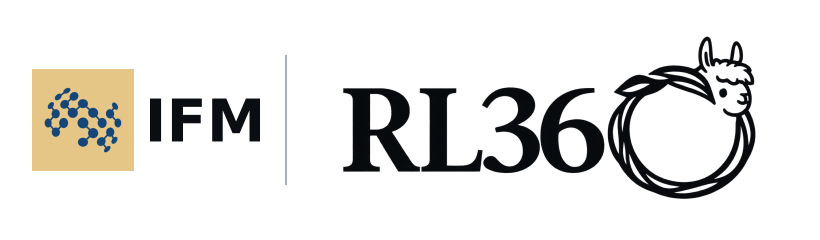
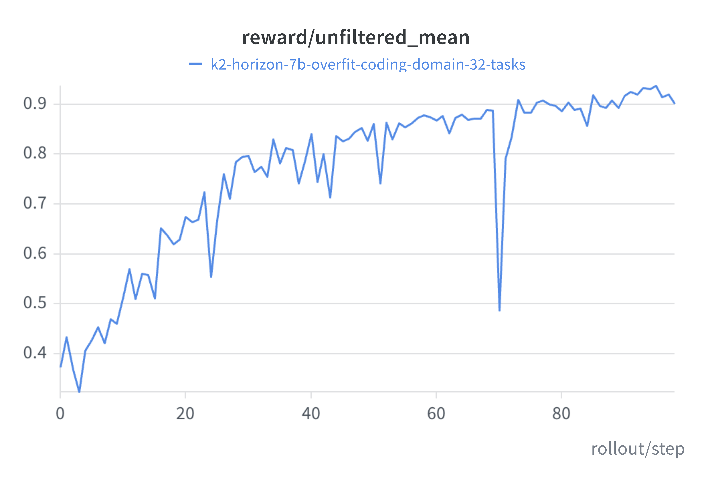
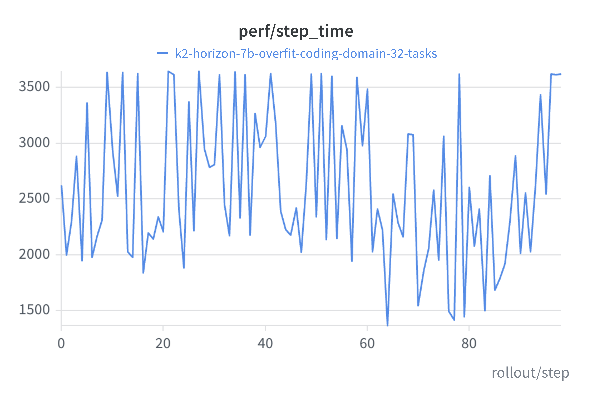
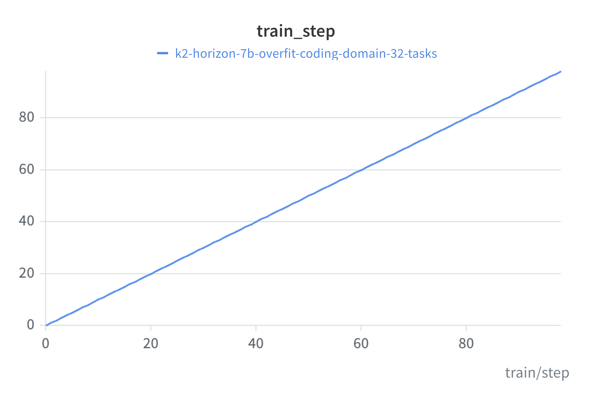
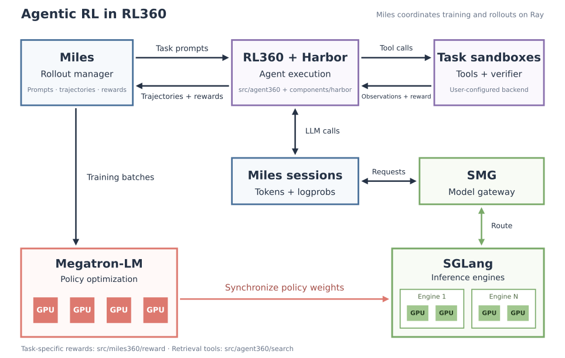

<p align="center"><picture><source media="(prefers-color-scheme: dark)" srcset="assets/ifm-rl360-dark.svg"><source media="(prefers-color-scheme: light)" srcset="assets/ifm-rl360-light.svg"></picture></p>

<p align="center"><a href="#run-the-coding-recipe"></a> <a href="https://ifm.ai/blog/k2/"></a> <a href="https://wandb.ai/mbzuai-llm/rl360-public"></a> <a href="https://github.com/ifm-ai"></a> <a href="https://x.com/IFM_AI"></a> <a href="https://discord.gg/SZzAQ3kFJ"></a></p>

# RL360

Reinforcement Learning codebase used in the post-training pipeline for the [K2 Horizon](https://ifm.ai/blog/k2/) series.

It trains language models on tasks that involve writing code, using tools, and working in a sandbox. The example below uses our [K2 Horizon 7B](https://huggingface.co/IFM/K2-Horizon-7B) model. To see how to switch models, see the [Qwen example](#using-qwen3-8b).

## K2 Horizon 7B: overfitting 32 coding tasks

As a working small-scale demo, we trained the K2 Horizon 7B model to overfit 32 coding tasks, sampling eight attempts per task. Mean reward rose from **0.373 to 0.901** over 99 rollout iterations. See the [public W&B workspace](https://wandb.ai/mbzuai-llm/rl360-public) for the run and charts, and [recipes/README.md](recipes/README.md) for the settings used.

<p align="center"><a href="assets/reward_curve.png"></a> <a href="assets/time_curve.png"></a> <a href="assets/step_curve.png"></a></p>

Left to right: mean reward across all attempts, step time in seconds, and training step. Step time includes training and waiting.

These are training-set results. Note that Reward includes a format penalty, so it differs from the task success rate. The job hit its 72-hour Slurm limit after 99 of the planned 100 iterations, which is why W&B shows it as `crashed`.

## Repository

The bundled components (miles, megatron, sglang etc) are checked in as ordinary directories.

| Path | Purpose |
| --- | --- |
| [`recipes/`](recipes/README.md) | Configurable Slurm recipe for overfitting on 32 mixed coding tasks |
| [`docker/`](docker/Dockerfile) | Public container build and reference dependency versions |
| [`src/agent360/harbor/miles/`](src/agent360/harbor/miles/) | Agent execution, Harbor service, reward logging, calibration, and runtime checks |
| [`src/agent360/search/`](src/agent360/search/) | Retrieval index construction and serving |
| [`src/miles360/reward/`](src/miles360/reward/) | Task-specific reward functions and grading utilities |
| [`src/miles360/token_mean_reducer.py`](src/miles360/token_mean_reducer.py) | Token-level loss reduction |
| [`components/miles/`](components/miles/) | Rollout orchestration and RL training entry points |
| [`components/megatron-lm/`](components/megatron-lm/) | Distributed model training |
| [`components/sglang/`](components/sglang/) | Inference runtime and kernels |
| [`components/smg/`](components/smg/) | Model gateway and routing |
| [`components/harbor/`](components/harbor/) | Sandboxes, agents, task execution, and verification |

## Architecture

Miles manages rollouts and training, Megatron-LM updates the policy, SMG routes requests to SGLang, and Harbor runs tasks and verifiers in sandboxes.



## Run the coding recipe

You will need a Linux x86_64 cluster with NVIDIA H100/H200 GPUs, Slurm, Docker Engine, the NVIDIA Container Toolkit, and shared storage. The container provides Python 3.12 and the training dependencies. The default allocation is 33 nodes with eight GPUs each: one service node, eight training nodes, and 24 rollout nodes. The service node does not use its GPUs. See the [recipe guide](recipes/README.md#configure-and-launch) for smaller allocations.

The commands below start from the public K2 Horizon 7B checkpoint and use a 128K context window. Note: The training run shown in the plots above used an earlier training checkpoint and a selected task set. Results obtained with the public checkpoint will differ.

### 1. Build the training container

Run this from the repository root on a machine with Docker. Replace `/shared` with a path available on your build machine and all Slurm nodes, and keep the repository under that path too.

```bash
mkdir -p /shared/images /shared/models /shared/data /shared/outputs
docker build -f docker/Dockerfile -t rl360:local .
docker save rl360:local -o /shared/images/rl360.tar
```

Run `docker load -i /shared/images/rl360.tar` on every Slurm node before submitting the job. Each node must have Docker Engine and the NVIDIA Container Toolkit configured for the user running the job.

The [Dockerfile](docker/Dockerfile) builds from a pinned public Miles image with PyTorch `2.9.1+cu129` and Transformer Engine `2.10.0`. It installs the bundled source and builds the SMG Rust extension. Package versions are in [docker/constraints.txt](docker/constraints.txt), with the cuDNN version in [docker/overrides.txt](docker/overrides.txt). Use this container setup for the recipe; the root `requirements.txt` lists dependencies for other parts of the codebase as well.

### 2. Download and convert the checkpoint

Download K2 Horizon 7B. This pins the model files to a specific public revision:

```bash
docker run --rm -v /shared:/shared rl360:local \
  hf download IFM/K2-Horizon-7B --revision d6a80e21f447768a61f1c976aa8e7d8e82a20d57 \
  --local-dir /shared/models/k2-horizon-7b-download
```

Prepare its configuration and tokenizer metadata for the bundled runtime:

```bash
docker run --rm -v /shared:/shared rl360:local \
  python recipes/prepare_k2_horizon.py \
  /shared/models/k2-horizon-7b-download /shared/models/k2-horizon-7b-hf
```

This creates a separate checkpoint directory. On the same filesystem, its weights and tokenizer vocabulary share the original files through hard links. The [preparation notes](recipes/README.md#k2-horizon-checkpoint-format) explain the metadata changes.

Convert the checkpoint for Megatron on a machine with eight GPUs. Keep both copies: SGLang reads the Hugging Face checkpoint, while Megatron reads the converted one.

```bash
docker run --rm --gpus all --ipc=host -v /shared:/shared rl360:local \
  torchrun --standalone --nproc-per-node=8 components/miles/tools/convert_hf_to_torch_dist.py \
  --hf-checkpoint /shared/models/k2-horizon-7b-hf \
  --save /shared/models/k2-horizon-7b-megatron \
  --swiglu --num-layers 36 --hidden-size 4096 --ffn-hidden-size 12288 \
  --num-attention-heads 32 --group-query-attention --num-query-groups 8 \
  --position-embedding-type rope --rotary-percent 1.0 --rotary-base 10000000 \
  --disable-bias-linear --normalization RMSNorm --norm-epsilon 1e-6 --layernorm-num-groups 4 \
  --vocab-size 250624 --kv-channels 128 \
  --untie-embeddings-and-output-weights
```

If your GPUs are only accessible through Slurm, run the same `torchrun` command in a one-node, eight-GPU Docker allocation with `/shared` mounted. Use a new output directory. When conversion finishes, that directory should contain `latest_checkpointed_iteration.txt` with the value `release`.

### 3. Prepare 32 tasks and a sandbox backend

Put 32 Harbor tasks in `/shared/data/overfit32` and list them in `harbor_records.jsonl`. Each task needs `instruction.md`, `task.toml`, an environment definition, and `tests/test.sh`. A manifest entry looks like this:

```json
{"prompt":"Solve the task.","metadata":{"instance_id":"task-001","tags":["coding"]}}
```

See [Tasks](recipes/README.md#tasks) for the directory layout and how we selected the overfit set. You will need to supply your own tasks. Their tags appear in reward metric names.

This example uses Daytona for sandboxes. Set up an account and enough sandbox capacity for your chosen concurrency. Docker is the only supported job container runtime in this snapshot.

### 4. Configure and validate

From the shared repository root, set the paths and backend. These paths must resolve to the same files on every node and inside the container.

```bash
export RL360_ROOT="$PWD"
export RL360_CONTAINER_IMAGE=rl360:local
export RL360_CONTAINER_MOUNTS=/shared:/shared
export RL360_HF_CHECKPOINT=/shared/models/k2-horizon-7b-hf
export RL360_TORCH_CHECKPOINT=/shared/models/k2-horizon-7b-megatron
export RL360_MODEL_ARGS_FILE="$RL360_ROOT/recipes/k2-horizon-7b.json"
export RL360_TASKS_DIR=/shared/data/overfit32
export RL360_OUTPUT_DIR=/shared/outputs/rl360
export RL360_CONTEXT_LENGTH=131072
export HARBOR_ENV_TYPE=daytona
read -rsp 'Daytona API key: ' DAYTONA_API_KEY
export DAYTONA_API_KEY

bash recipes/coding-overfit32.sbatch --dry-run
```

The dry run checks the inputs and prints the trainer command without allocating GPUs. For tasks with oracle solutions, check that the solutions pass their verifiers before training. Run this on the Docker machine with `DAYTONA_API_KEY` exported there too:

```bash
docker run --rm -e DAYTONA_API_KEY -v /shared:/shared rl360:local \
  harbor run --path /shared/data/overfit32 --agent oracle --env daytona \
  --n-concurrent 4 --jobs-dir /shared/outputs/oracle-validation
```

Check the oracle results for verifier failures or sandbox errors. The launcher also checks imports, visible GPUs, and service readiness when the training job starts. For memory or disk issues, the repository has [memory](src/agent360/harbor/miles/memory_preflight.py) and [storage](src/agent360/harbor/miles/storage_preflight.py) checks you can run with your cluster's limits.

### 5. Run one iteration, then train

Try one iteration first. Replace the account and partition with your cluster's settings:

```bash
export RL360_NUM_ROLLOUT=1
sbatch --account=YOUR_ACCOUNT --partition=YOUR_PARTITION recipes/coding-overfit32.sbatch
```

Check `slurm-<job-id>.log` and `/shared/outputs/rl360/<job-id>/`. The Ray job should finish successfully, and the saved trajectories should contain verifier rewards. Then submit a fresh training run:

```bash
export RL360_NUM_ROLLOUT=100
sbatch --account=YOUR_ACCOUNT --partition=YOUR_PARTITION recipes/coding-overfit32.sbatch
```

The defaults are GRPO, eight samples per task, a `5e-6` learning rate, dynamic filtering, and a checkpoint every 10 iterations. [recipes/README.md](recipes/README.md) lists the full settings and resource overrides.

For W&B logging, export `WANDB_ENTITY`, `WANDB_PROJECT`, and `WANDB_API_KEY` before submitting. Use `WANDB_MODE=offline` to keep logs local. The integration logs selected training settings and disables automatic code, machine metadata, and console uploads. Check task labels and any files you upload before making a run public; moving an existing run to another project keeps its old metadata.

The release recipe has local validation checks, but the Docker build, checkpoint conversion, and full GPU run still need to be tested together on the target cluster.

### Using Qwen3-8B

To try another model, follow the [Qwen3-8B download and conversion steps](recipes/README.md#qwen3-8b), then replace the model settings in step 4:

```bash
export RL360_HF_CHECKPOINT=/shared/models/qwen3-8b-hf
export RL360_TORCH_CHECKPOINT=/shared/models/qwen3-8b-megatron
export RL360_MODEL_ARGS_FILE="$RL360_ROOT/recipes/qwen3-8b.json"
export RL360_CONTEXT_LENGTH=32768
```

The task and launch steps stay the same. The Qwen example uses a 32K context window and its own architecture and parser settings.

## License

RL360 is distributed under the [Apache License 2.0](LICENSE). Bundled components retain their own licenses and notices; see [THIRD_PARTY_NOTICES](THIRD_PARTY_NOTICES).

## About IFM

RL360 is developed by researchers and engineers at the [Institute of Foundation Models (IFM)](https://ifm.ai/about/) at [MBZUAI](https://mbzuai.ac.ae/). We work on open foundation models, including [K2 Horizon](https://ifm.ai/blog/k2/), and the training systems behind them.

<p><a href="https://ifm.ai/"></a> <a href="https://huggingface.co/IFM"></a> <a href="https://github.com/ifm-ai"></a> <a href="https://x.com/IFM_AI"></a> <a href="https://discord.gg/SZzAQ3kFJ"></a></p>
